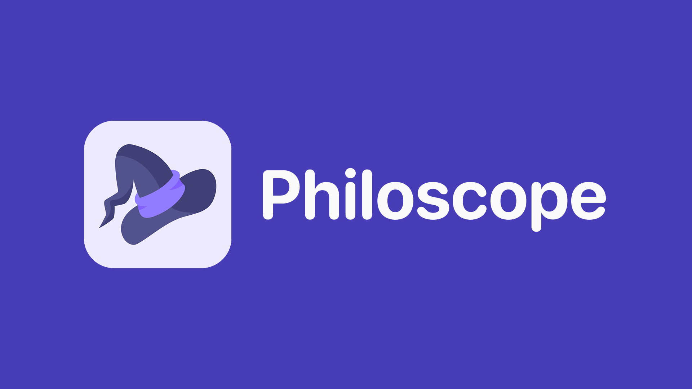
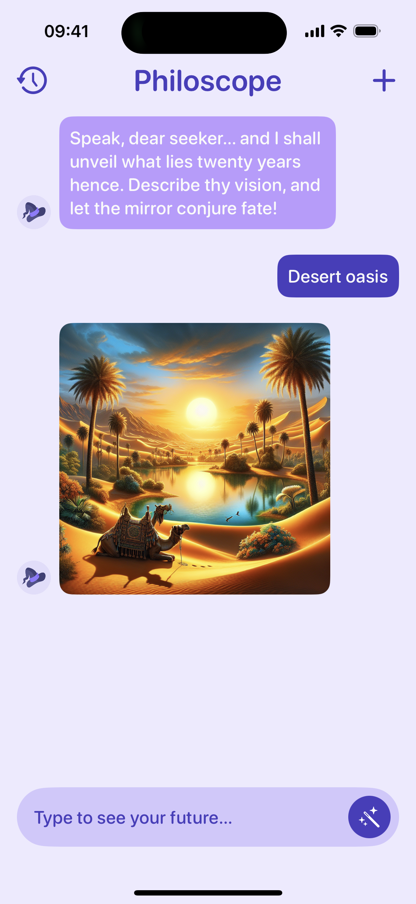
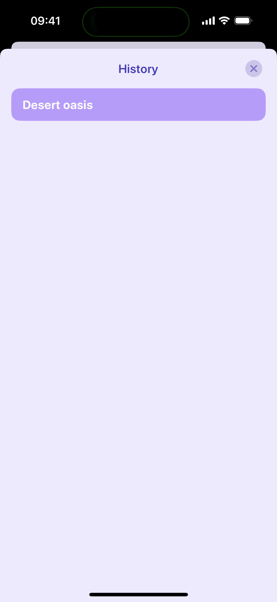

# Philoscope

Philoscope is a magical mirror app for iOS that acts like a wizard, showing users how the objects in their prompts might appear in the future. When a user enters a simple prompt, Philoscope uses OpenAI's GPT-4o-mini to expand and refine it into a detailed description. This enhanced prompt is then sent to DALL·E 3, which generates a 1024x1024 pixel image based on the description. Philoscope is built with SwiftUI and modern Swift concurrency to provide a smooth and interactive experience.

## 🎨 Design
- [Figma Design File](https://www.figma.com/design/IioIHIcXR84xL3Qt4sKZST/Philoscope?node-id=41-584&t=Eq81A30wyrU9TKdt-1)

## 🚀 Features
- Refines user prompts using GPT-4o-mini.
- Generates high-quality images with DALL·E 3.
- Displays images in a chat-like interface using SwiftUI.
- Implements programmatic navigation with SwiftfulRouting.

## 🧰 Tech Stack
- Language: Swift 6
- Frameworks: SwiftUI, Swift Concurrency
- Navigation: SwiftfulRouting
- Platform: iOS 17+ (Simulator or real device)

## 🛠 Setup Instructions

### 1. Prerequisites
- Ensure you have the latest version of Xcode installed.

### 2. Clone the Repository
```bash
git clone https://github.com/yourusername/philoscope.git
cd philoscope
```

### 3. Open the Project in Xcode
Double-click on Philoscope.xcodeproj to open the project in Xcode.

### 4. Add Your OpenAI API Key
In the Constants.swift file, locate the Secrets struct and add your OpenAI API key:

```swift
struct Secrets {
    static let openAIKey = "sk-..."
}
```

### 5. Build and Run
- Select your target device (iOS 17+ simulator or real device).
- Press Cmd + R to build and run the app.

## 📱 Demo

<p align="center">
  
  
</p>

### 🎥 Demo Video

Check out Philoscope in action:

[Watch the Philoscope demo video on YouTube](https://youtube.com/shorts/VuNs3bYFKZM)
